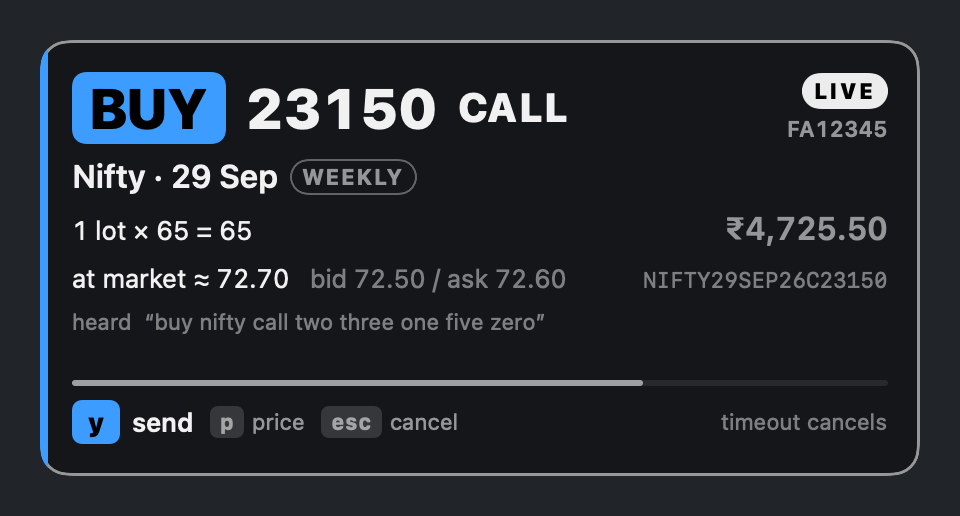

# Sayso for Mac

**Voice trading for Shoonya, in a small panel beside your chart.** Speak the
order, glance at the card, press `y`.



> **Real money.** Every order you confirm with `y` goes to your Shoonya
> account. There is no paper-trading mode. Start with a 1-share order.
> Sayso places the orders you ask for; it is not investment advice. It is
> an independent project, not affiliated with Shoonya or Finvasia.

## What it does

1. **You speak.** Hold the talk key (⌃⌥Space by default) and say it the way
   you would to a dealer:
   - "Buy two lots of Nifty 23100 call"
   - "Buy 10 Infosys intraday"
   - "Exit my Bank Nifty put"
   - "What is Nifty at?"
2. **Sayso works out the exact order.** It finds the contract in the broker's
   own symbol master, prices it against the live market, and checks it
   against your limits. Anything unclear gets a question, never a guess.
3. **You confirm with a key, never your voice.** The card shows the resolved
   order, and Sayso reads it back. `y` sends it, and only once the card has
   been on screen for 0.7 s. `Esc`, a timeout, or losing the engine cancels.
4. **It follows through.** Fills, rejections and "may be live" are shown and
   spoken. A resting order is followed until it fills.

**Supported:**
- Nifty, Bank Nifty and Sensex options: buy to open, and exit;
- Nifty 50 stocks: buy and sell, intraday or delivery;
- quotes, positions, funds, today's orders and your limits, by voice.

## Requirements

- An Apple Silicon Mac (M1 or later) on macOS 14 or later.
- Xcode or the Command Line Tools (Swift 5.10 or later), to build the panel.
- Python 3.12 or 3.13 (Homebrew's is fine), for the engine.
- A Shoonya account with API access. On its API key page, set the redirect
  URL to exactly `http://127.0.0.1:8787/` and register your IP address.
  Options need the F&O segments: NFO for Nifty and Bank Nifty, BFO for
  Sensex.

## Build and run

There is no prebuilt download yet; signed builds come later. From source:

```bash
git clone https://github.com/etyagi07/sayso-mac
cd sayso-mac
(cd sayso && ./setup.sh)     # the engine's Python environment (a few minutes)
app/build.sh                 # builds app/build/Sayso.app
open app/build/Sayso.app     # LIVE: real orders
```

On first launch, accept the one-time notice. **Setup & health** then walks
you through connecting Shoonya, registering this Mac's IP, and setting up
the microphone. The speech model (about 0.5 GB) downloads the first time you
speak. After that, read the [user guide](docs/user-guide.md).

## How it's built

| Part | What it does |
|---|---|
| `sayso/` | The engine: speech → order, contracts, prices, limits, sending and following orders, login. A fork of Sayso, the terminal voice trader |
| `bridge/` | Runs the engine as a local background process on `127.0.0.1:8787`, with a per-run secret only your app knows |
| `app/` | The native SwiftUI panel. It shows what the engine decides and holds no trading logic |

**Privacy.** Speech is recognised on your Mac. Nothing goes anywhere except:
- your orders and account requests, to Shoonya;
- one-time downloads: Shoonya's connector from PyPI and the speech model from
  Hugging Face.

Your API secret is asked for at login and never saved.

## Tests

```bash
./test.sh
```

It runs every suite: the engine (16 files), the bridge (65 tests over real
HTTP) and the panel (49). None of them needs a broker, a microphone or
credentials, and nothing is sent anywhere.

## More

- [User guide](docs/user-guide.md): set-up, keys, sounds, limits, accounts,
  troubleshooting.
- [Development notes](docs/development.md): the layout, packaging and signing.
- [Panel design](docs/face-spec.md) and the [engine's README](sayso/README.md),
  including notes on the Shoonya API.

## Licence

MIT. See [LICENSE](LICENSE).
